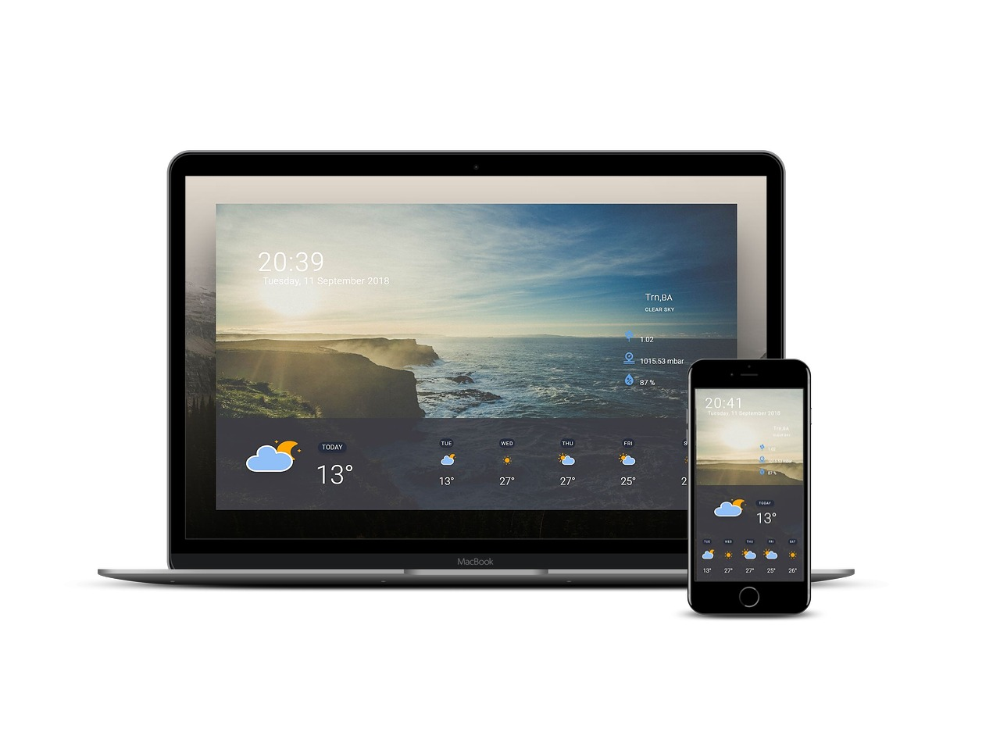

# myWeather

>  Website - [myWeather]( https://vladimirblagojevic.github.io/myWeather/)

---

### Table of Contents

- [Description](#description)
- [How To Use](#how-to-use)
- [References](#references)
- [License](#license)
- [Author Info](#author-info)

---

## Description

 Project that i made to practice async function and API use. U getting weather info on your location in real time for next five days, also wind and humidity-plus current time and date.

#### Technologies

- JavaScript
- HTML & CSS
- Sass (SCSS)
- npm
- git

[Back To The Top](#read-me-template)

---

## How To Use

#### Installation

- npm install

#### To run sass script  type:

- npm run watch:sass

#### API Reference

- API used can be found on this link 
  - [OpenWeatherMap](https://openweathermap.org/api)
  - [Geolocation API](https://w3c.github.io/geolocation-api/#navi-geo)
  

[Back To The Top](#read-me-template)

---

## References

- Design credits go to Tomasz on [Dribbble](https://dribbble.com/tomaszzagorski)
- Icons used are from [amCharts](https://www.amcharts.com/free-animated-svg-weather-icons/)
  
[Back To The Top](#read-me-template)

---

## License

MIT License

Copyright (c) [2018] [Vladimir Blagojevic]

[Back To The Top](#read-me-template)

---

## Author Info

- Twitter - [@Vladimir B.](https://twitter.com/Kvout90)
- Website - [Vladimir B.](https://github.com/VladimirBlagojevic)

[Back To The Top](#read-me-template)